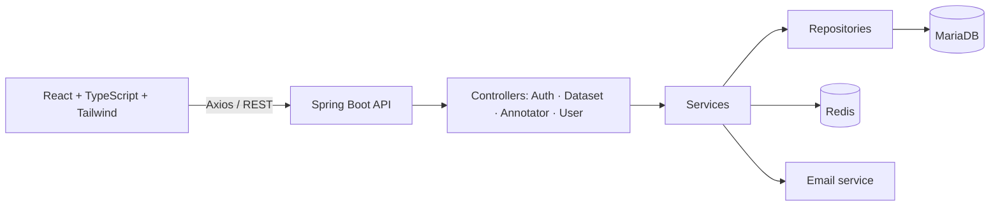
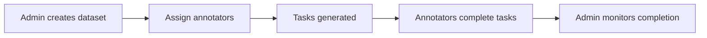

<div align="center">

# 🏷️ TagWise

**A full-stack data annotation management platform built with Spring Boot and React**


[Features](#-features) • [Architecture](#-architecture) • [Getting Started](#-getting-started) • [Roadmap](#-roadmap)

</div>

---

## 📖 About

**TagWise** manages **data annotation workflows**. Administrators create datasets, assign annotators, manage accounts and monitor progress; annotators access their assigned datasets and work on annotation tasks through a dedicated interface.

The **Spring Boot** backend provides a secure REST API (JWT, role-based access, email verification backed by **Redis**), and the **React + TypeScript + Tailwind CSS** frontend offers separate administrator and annotator experiences.

---

## ✨ Features

| | Module | Description |
|---|---|---|
| 🔐 | **Authentication** | Signup and login with JWT, password hashing and email verification |
| ⚡ | **Redis verification** | Short-lived verification codes stored with automatic expiration |
| 👥 | **Role-based access** | Separate ADMIN and ANNOTATOR interfaces, enforced on API and frontend |
| 📦 | **Dataset management** | Dataset upload (multipart), annotation classes, listing and details view |
| 🎯 | **Annotator assignment** | Assign annotators to datasets |
| 👩‍💻 | **Annotator management** | List, edit, activate/deactivate and soft-delete annotators |
| 📝 | **Annotation tasks** | Datasets split into tasks of text pairs |
| 📊 | **Progress tracking** | Completed vs. remaining tasks and completion percentage per dataset |

---

## 🧱 Architecture



**Roles**

| Role | Capabilities |
|---|---|
| **ADMIN** | Manage datasets and annotators, assign datasets, monitor progress |
| **ANNOTATOR** | View assigned tasks, perform annotations, track own work |

**Platform workflow**



<details>
<summary><b>📂 Project structure</b></summary>

```text
├── backend/                         # Spring Boot (Maven)
│   └── src/main/java/com/nli/tagwise/
│       ├── config/                  # Security, JWT filter, email, app config
│       ├── controllers/             # Authentication, Dataset, Annotator, User
│       ├── dto/                     # Dataset, Annotator, Task, TextPair DTOs...
│       ├── models/                  # User, Dataset, DatasetAnnotator, Task, Role
│       ├── repository/              # JPA repositories
│       └── services/                # Authentication, Dataset, Task, Jwt, Redis, Email
└── frontend/                        # React + Vite
    └── src/
        ├── components/              # AdminSidebar, ProtectedRoute...
        ├── context/AuthContext.tsx
        ├── pages/                   # Auth, admin/annotator homes, dataset/, annotators_management/
        └── utils/                   # api.ts, jwt.ts
```

</details>

---

## 🛠️ Tech Stack

| Layer | Technologies |
|---|---|
| **Backend** | Java 17, Spring Boot 3.4.5, Spring Security, Spring Data JPA, Spring Mail, JWT, Redis (Lettuce), Hibernate, Lombok, Maven |
| **Frontend** | React 19, TypeScript, Vite, Tailwind CSS, Axios, React Router, React Hook Form, JWT Decode |
| **Data** | MariaDB (persistent), Redis (temporary) |

---

## 🚀 Getting Started

**Prerequisites:** Java 17, Node.js and npm, MariaDB, Redis

```bash
git clone https://github.com/hanaekhayyi/TagWise1.git
cd TagWise1
```

**Backend**: create a MariaDB database, set the connection in `backend/src/main/resources/application.properties` (default: `jdbc:mariadb://localhost:3307/npm`), and make sure Redis runs on `localhost:6379`:

```bash
cd backend
./mvnw spring-boot:run        # Windows: mvnw.cmd spring-boot:run
```

**Frontend**: in a second terminal:

```bash
cd frontend
npm install
npm run dev                   # http://localhost:5173
```

---

## 🧭 Roadmap

**Security & Engineering**
- [ ] Move JWT, database and email secrets to environment variables
- [ ] Docker and Docker Compose (MariaDB, Redis, backend, frontend)
- [ ] Automated tests and Swagger / OpenAPI documentation
- [ ] Online deployment

**Annotation quality**
- [ ] CSV dataset validation
- [ ] Quality-control mechanisms and inter-annotator agreement metrics
- [ ] Annotation history and dataset export

**Product**
- [ ] Statistics, charts and advanced dashboard KPIs
- [ ] Task deadlines and messaging between admins and annotators

---

<div align="center">

### 👩‍💻 Author

**Hanae KHAYYI** · Data & AI Engineering Student

[](https://github.com/hanaekhayyi)

⭐ *If you found this project useful, feel free to star the repository.*

</div>
